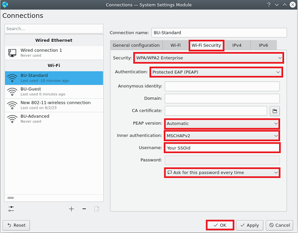
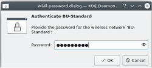
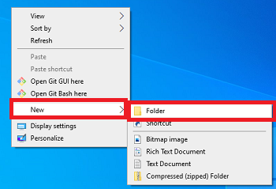
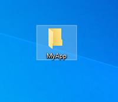
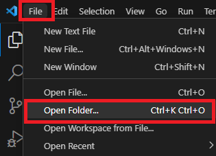

# Smart GUI Alert System with Python

## Learning Outcomes

By finishing this session, you should be able to

- Retrieve data from the Mongo DB Atlas database.
- Use a Graphical User Interface (GUI) to dispaly data and altert.

## Github Page

- [https://github.com/scie1006-2023/comp/blob/main/casestudy2.md](https://github.com/scie1006-2023/comp/blob/main/casestudy2.md)

## Part 1: Getting Started

We learned how to record the environment's temperature and humidity in the earlier lessons and send the information to a cloud database. We will now learn how to use a GUI application to retrieve the data from the database and notify the user when the sensor reading deviates from the expected range.

Before obtaining data from the cloud database, the sensor must be turned on and the **`sensor.py`** be running so that data can be continuously uploaded to the database.

1. Power on the ROCK PI device and log in using the provided username and password.
2. Connect to the WIFI network.
   i.  Click the Networks icon on the task bar, and then click the Connect button on BU-Standard.

   
      <div style="page-break-after: always;"></div>
   ii.  Configure the connection as follows and then click OK.

   

   iii.  Click the Connect button on BU-Standard again, and input your password to connect to the netwrok.

   
3. Right-click the desktop and select Create New, followed by Folder.

   
4. Enter "MyProject" as the folder name, then click OK.

   
   <div style="page-break-after: always;"></div>
5. Launch Visual Studio Code by clicking the icon in the task bar.

   
6. Choose Open Folder from the File menu.

   
7. After finding the MyProject folder on Desktop, click Open.

   
   
8. Get back the **`sensor.py`** you have completed in **workshop 2** and save it to the MyProject folder.
  
    ```python
      from smbus2 import SMBus
      import time
      from pymongo import MongoClient
      import datetime
      
      # Your URI copied from MongoDB Atlas website
      # Replace <password> with the password you created for your database user
      uri = 'mongodb+srv://db:<password>@cluster0...:27017/'
      client = MongoClient(uri)
      db = client.database

      bus = SMBus(7)
    
      # The code block inside while True loop repeats continuously until 
      # you press Ctrl+C in the terminal
      while True:
         # trigger the sensor to do measurement
         bus.write_i2c_block_data(0x38, 0xAC, [0x33, 0x00]) 
         # wait for 0.5 seconds
         time.sleep(0.5)
         # read data from the sensor
         data = bus.read_i2c_block_data(0x38, 0x00, 8)

         temp = ((data[3] & 0x0F) << 16) | (data[4] << 8) | data[5]
         humi = ((data[1] << 16) | (data[2] << 8) | data[3]) >> 4
         
         temperature = temp / (2**20) * 200 - 50
         print(u'Temperature: {0:.1f}°C'.format(temperature))

         humidity = humi / (2**20) * 100
         print(u'Humidity: {0:.1f}%'.format{humidity})         
         
         record = {
            "sensor_id": 1,
            "temp": temperature,
            "humi": humidity,
            "date": datetime.datetime.now(),
         }
         
         db.sensors.insert_one(record)
         
         # wait for 60 seconds
         time.sleep(60) 
      ```

9.  Run the **`sensor.py`** program.
   
## Part 2: Retirving data from MongoDB

1. Right-click the desktop of the notebook, choose New and then Folder to create a new folder called `MyApp`.
   *(Note: You can also do this part on the ROCK Pi.)*
   
    
   <div style="page-break-after: always;"></div>
2. Click the Start icon, and choose Visual Studio Code from the start menu.
   
   

3. Choose Open Folder from the File menu.

   
4. After finding the MyApp folder on Desktop, click Select Folder.

   
   
5. In the Explorer, click the New File... button to create a file called **`gui.py`**.
   
   
   <div style="page-break-after: always;"></div>
6. First we need to connect to the MongoDB database with the following code.

    ```python
    from pymongo import MongoClient
    import datetime

    # Your URI copied from MongoDB Atlas website
    # Replace <password> with the password you created for your database user
    uri = 'mongodb+srv://db:<password>@cluster0...:27017/'
    client = MongoClient(uri)
    db = client.database
    collection = db.sensors      
    ```
7. To retrieve data from the MongoDB, we need to use the `find()` method. We sort the data by the date and get the last record for the latest data.

    ```python
    # Get the last record from the collection (sorted by "date")
    lastRecord = collection.find().sort("date", -1).limit(1)[0]    
    ```

8. The temperature value can be obtained by `lastRecord['temp']`. To print the result, we write:
   ```python
   print("Temperature: {0:.1f} °C".format(lastRecord['temp']))
   ```
   
9.  **Exercise: Retriving the humidity data from the cloud database**

    Write code in the program to retrieve the humidity data from the MongoDB and point it out. The humidity value can be obtained by `lastRecord['humi']`.


## Part 3: Building a GUI Applicaton with pygame

In this part, we will use the `pygame` library to create the GUI.

1. Let's import the the library and initialize it.
   ```python
   import pygame 

   # initialize the pygame library and prepare it for use
   pygame.init() 
   ```
2. For a GUI application, we have to set the window size and name.
   ```python
   # set window size to 400x300 pixels
   window = pygame.display.set_mode((400, 300))   
   # set the window name
   pygame.display.set_caption('My Alert')   
   ```
3. We can also create a font for text display and a clock to control the frame rate of the application.
   ```python   
   # create a font Arial with size 30 for text display
   font = pygame.font.SysFont("Arial", 30)
   # create a clock to control frame rate
   clock = pygame.time.Clock()
   ```
4. Then, we can use a while loop to continuously retrieving data from the database. Put the following code right **before** the line `lastRecord = collection.find().sort("date", -1).limit(1)[0]`, then put this line and the rest of the program inside the loop.
   ```python

   # The code block inside while True loop repeats continuously until 
   # you press Ctrl+C in the terminal
   while True:
       # process any pending events to ensure the application remains responsive
       pygame.event.pump()
   ```
   
5. Let's set the background color to white before we draw the text.
   ```python
       # fill the window with white color by RGB code (255, 255, 255)
       window.fill((255, 255, 255))
   ```
   See [RGB Color Codes Chart](https://www.rapidtables.com/web/color/RGB_Color.html) for color code.
6. To show text on the window, we first create a text surface and then draw it at a position. In pygame, positions are always supplied as a (X,Y) coordinate. This represents how many pixels down and how many pixels to the right the surface should be placed. 
   ```python
       # create a text surface with black color, RGB code (0, 0, 0)
       tempText = font.render("Temperature: {0:.1f}°C".format(lastRecord['temp']), True, (0, 0, 0))    

       # draw the tempText sruface at the position (10, 10)
       window.blit(tempText, (10, 10))
   ```

7. Finally, we update the display using `pygame.display.update()` limit the frame rate to 1 frame per second using clock.tick(1).
   ```python
       # update the display window
       pygame.display.update()      
       # set the frame rate to 1 frame per second
       clock.tick(1) 
   ```
8. **Exercise: Displaying humidity value in the window**
   
   Draw the humidity data on the window. Make it under the temperature data.

   *Sample output*

   
   
## Part 4: Alerting the User with Colors

In this section, we will determine whether the temperature is within the normal range. The background color of the window will change to inform the user if the temperature rises above 28°C.

Let's replace  `window.fill((255, 255, 255))` with the following code:

```python
    if lastRecord['temp'] > 28:
       window.fill((255, 0, 0))
    else:
       window.fill((255, 255, 255))
```

The above code will change the background color to red if the temperature is higher than 28°C. Otherwise, it will change the background color to white.

## Submission and Demo
- You have to **demonstrate** your work to the instructor(s) before the end of the class.
- You have to submit **`gui.py`** to the Moodle submission box.

## Discussion
Discussion Question: What more applications can we create for a smart city besides alert systems?
- Answer the discussion questoin in the Moolde submission box.

## References

- (n.d.). News New here?. https://www.pygame.org/

- Python conditions. (n.d.). W3Schools Online Web Tutorials. https://www.w3schools.com/python/python_conditions.asp

- Python, R. (2018, September 5). Conditional statements in Python – Real Python. Python Tutorials – Real Python. https://realpython.com/python-conditional-statements/

- Rock Pi 4 - the next generation RPI. (n.d.). Meet ROCK - Single Board Computers from Radxa. https://rockpi.org/rockpi4

- Tutorial. (n.d.). PyMongo 4.4.1 documentation. https://pymongo.readthedocs.io/en/stable/tutorial.html