# Collecting and Visualizing Live Data from Sensors with Python and MongoDB

## Learning Outcomes

By finishing this session, you should be able to

- Read values from sensors
- Store sensor data to MongoDB Atlas database
- Visualze sensor data with MongoDB charts

## Github Page

- [https://github.com/scie1006-2023/comp/blob/main/workshop2.md](https://github.com/scie1006-2023/comp/blob/main/workshop2.md)

## Part 1: Getting Started

1. Power on the ROCK PI device and log in using the provided username and password.
2. Connect to the BU-Standard WIFI network.
   i.  Click the Networks icon on the task bar, and then right-click the Connect button on BU-Standard and choose Configure...

   
   <div style="page-break-after: always;"></div>
   ii.  Configure the connection as follows and then click OK.

   

   iii.  Click the Connect button on BU-Standard again, and input your password to connect to the netwrok.

   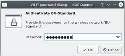

   
3. Right-click the desktop and select Create New, followed by Folder.

   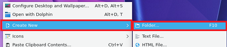
4. Enter "MyProject" as the folder name, then click OK.

   

   <div style="page-break-after: always;"></div>
5. Launch Visual Studio Code by clicking the icon in the task bar.

   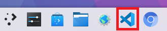
6. Choose Open Folder from the File menu.

   
7. After finding the MyProject folder on Desktop, click Open.

   
8. In the Explorer, click the New File... button to create a file called **`basics.py`**.

   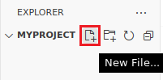
9. Copy and paste the code below into **`basics.py`**. You can press`Ctrl+V` to paste the copied code.

    ```python
    import datetime
    print(f'Hello, now is {datetime.datetime.now()}')
    ```
<div style="page-break-after: always;"></div>

10. Choose Save from the File menu or press Ctrl+S to save the file.

    
11. Click the run button at the upper right to execute the program. The result will be shown in the terminal.

    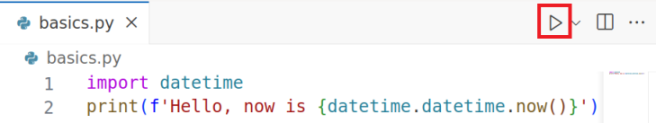

## Part 2: Python Basics

1. Variables and Data Types

   ```python
   number = 123   # int (whole number)
   pi = 3.1415    # float (with decimal pont)
   message = "Welcome aboard!"  # string (text)
   ```

   A python variable is created as soon as a value is assigned to it. There are a certain rules that we have to keep in mind while creating a variable:
   - The variable name cannot start with a number. It can only start with a character or an underscore.
   - Variables in python are case sensitive.
   - They can only contain alpha-numeric characters and underscores. No special characters are allowed.
  
2. Basic Arithmetic Operators
   - `+` (addition)
   - `-` (subtraction)
   - `*` (multiplicatoin)
   - `/` (division)
   - `**` (exponentiation)

   ```python
   x = 5
   y = 2
   print(x + y)   # 7
   print(x - y)   # 3
   print(x * y)   # 10
   print(x / y)   # 2.5
   print(x ** y)  # 25
   ```

3. Output Formatting

   ```python
   name = 'Alice'
   print(name) # Alice
   print(f'{name} is pretty.') # Alice is pretty.
   
   temperature = 25.28
   print(temperature)  # 25.28
   print( u'{0}°C'.format(temperature))     # 25.28°C
   print( u'{0:.1f}°C'.format(temperature)) # 25.3°C (1 d.p.)
   ```

## Part 3: Reading Values from Sensors

   The Rock Pi device's I2C bus number `7` is already wired to an AHT-10 humidity and temperature sensor. The I2C address of the sensor is `0x38`. To read data from the I2C bus, we have to use the    `smbus2` library and follow the instructions in the [hardware data sheet](https://www.aosong.com/userfiles/files/media/Data%20Sheet%20AHT20.pdf).

   

   1. Create a file called **`sensor.py`** and put the following code into the file.

      ```python
      from smbus2 import SMBus
      import time

      bus = SMBus(7)

      # trigger the sensor to do measurement
      bus.write_i2c_block_data(0x38, 0xAC, [0x33, 0x00])
      # wait for 0.5 seconds 
      time.sleep(0.5)
      # read data from the sensor
      data = bus.read_i2c_block_data(0x38, 0x00, 8)
      ```

      In the above code, we send `0xAC` command with payload `[0x33, 0x00]` to address `0x38`. The `0xAC` command with payload `[0x33, 0x00]` will trigger the sensor to do measurement. Then, we wait for 0.5 seconds and read the data from the sensor. The data is read from address `0x38` with command `0x00` and blcok length equals to `8`. We then store result data in the data variable.

   2. According to the hardware data sheet, we have to extract the temperature data from the data variable by the following code:

      ```python
      temp = ((data[3] & 0x0F) << 16) | (data[4] << 8) | data[5]
      ```

      The above code uses `bitwise` operations (`Shift`, `AND` and `OR`) to extract the temperature data from the data variable. The temperature data is stored in the `temp` variable.

      And, we could extract the humidity data by the following code:

      ```python
      humi = ((data[1] << 16) | (data[2] << 8) | data[3]) >> 4
      ```

   3. The formula to calculate the temperature from the `temp` data is as follows:
      $$Temperature = (\frac{temp}{2^{20}}) \times 200 - 50$$

      We could calculate the temperature value in celcius degree by using the following code:

      ```pthon
      temperature = temp / (2**20) * 200 - 50
      ```

      And, we could print it out using the following code:

      ```pthon
      print(u'Temperature: {0:.1f}°C'.format(temperature))
      ```

      *Sample output:*

      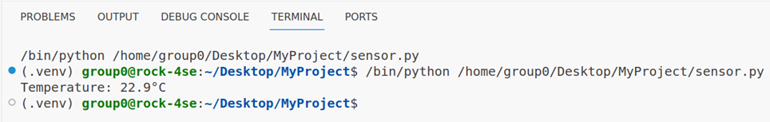
      
   4. **Exercise: Calculate and print the humidity**
      The formula to calculate the humidity (in percentage) from the `humi` data is as follows:
   
      $$Humidity = (\frac{humi}{2^{20}}) \times 100$$

      In your program, add Python code to calculate and print the humidity value (in percentage) using the above formula.

      *Sample output:*
      
      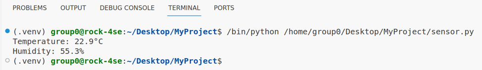

## Part 4: Storing Sensor data to MongoDB Atlas database

   In this section, we will use a cloud database MongoDB Atlas to store the sensor data.

#### A. Sign up for a MongoDB Atlas account

   1. To sign up for a MongoDB Atlas account, go to the following URL:

      [https://www.mongodb.com/cloud/atlas/register](https://www.mongodb.com/cloud/atlas/register)

      

      <div style="page-break-after: always;"></div>
   2. You will need to fill-up a questionnaire for the first time setup. You could fill-up the questionnaire as follows:

      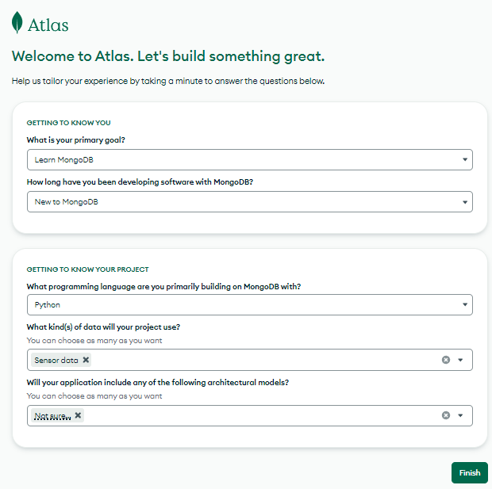

   3. After that, you will need to create a MongoDB cluster. A cluster is a group of servers that store your data. Then, select the "M0" option. Then, select the "AWS" option. In the "Region" dropdown list, select "Hong Kong". Give it a name as your like and click on the "Create" button.

      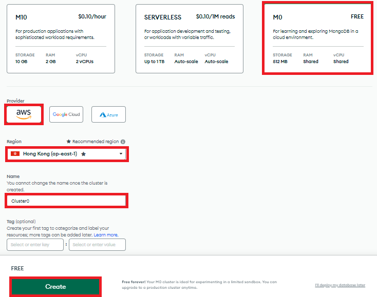

   4. Then, fill in the username and password for your MongoDB database. **Please keep the password as you will need it later**. Then, click on the "Create User" button.

      

   5. Click on the "Network Access" tab, choose "Cloud Environment" and then click on the "Add IP Address" button. Then, click on the "Allow Access from Anywhere" button. Please add a entry for `0.0.0.0/0` as follows:
   
      

      
   6. To complete, click the "Finish and Close" button in the bottom right corner.
      <div style="page-break-after: always;"></div>
   7. Click on "Go to Dashboard" button in the following screen.
      
      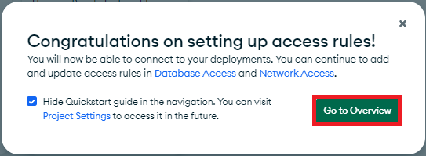

#### B. Store sensor data in MongoDB database

   In order to connect to your MongoDB database, you will need to generate a MongoDB URI, use the URI to connect to the databse, and then send data into the database.

   1. After logged-in to your MongoDB Atlas account, click on the "Connect" button for your cluster.

      

      Please replace `<password>` with the password you created for your database user.
      <div style="page-break-after: always;"></div>
   2. Then, click on "Driver". 
   
      

   3. Select "Python" as the driver and "3.6 or later" as the version. Then, click on "Copy" to copy the URI to your clipboard. You will need to paste this URI into your Python code.

      
   4. To connect to the MongoDB database, we need to use the `pymongo` libaray with the following code.

      ```python
      from pymongo import MongoClient
      import datetime

      # Your URI copied from MongoDB Atlas website
      # Replace <password> with the password you created for your database user
      uri = 'mongodb+srv://db:<password>@cluster0...:27017/'
      client = MongoClient(uri)
      db = client.database      
      ```
      
   5. To store data in the MongoDB database, we have to create a record from the sensor data and insert it to the database.

      ```python      
      # Create a record variable to store the sensor data
      record = {
         "sensor_id": 1,
         "temp": temperature,
         "humi": humidity,
         "date": datetime.datetime.now(),
      }

      # Insert the record into the sensors collection
      db.sensors.insert_one(record)
      ```

   6. Now that we have learned how to read sensor data, and store sensor data in a MongoDB database. To continuously read the temperature and humidity data from the sensor and save it in the MongoDB database, we could put everything into an infinite loop.

      ```python
      from smbus2 import SMBus
      import time
      from pymongo import MongoClient
      import datetime
      
      # Your URI copied from MongoDB Atlas website
      # Replace <password> with the password you created for your database user
      uri = 'mongodb+srv://db:<password>@cluster0...:27017/'
      client = MongoClient(uri)
      db = client.database

      bus = SMBus(7)
    
      # The code block inside while True loop repeats continuously until 
      # you press Ctrl+C in the terminal
      while True:
         # trigger the sensor to do measurement
         bus.write_i2c_block_data(0x38, 0xAC, [0x33, 0x00]) 
         # wait for 0.5 seconds
         time.sleep(0.5)
         # read data from the sensor
         data = bus.read_i2c_block_data(0x38, 0x00, 8)

         temp = ((data[3] & 0x0F) << 16) | (data[4] << 8) | data[5]
         humi = ((data[1] << 16) | (data[2] << 8) | data[3]) >> 4
         
         temperature = temp / (2**20) * 200 - 50
         print(u'Temperature: {0:.1f}°C'.format(temperature))

         # Exercise code: Read and print the humidity data from the sensor
         humidity = ...
         print(...)         
         
         record = {
            "sensor_id": 1,
            "temp": temperature,
            "humi": humidity,
            "date": datetime.datetime.now(),
         }
         
         db.sensors.insert_one(record)
         
         # wait for 60 seconds
         time.sleep(60) 
      ```

      The above code will read the temperature and humidity data from the sensor every 60 seconds and store the sensor data in the MongoDB database.

      If you would like to stop the program, you may press `Ctrl + C` in the terminal.

## Part 5: Visualizing sensor data with MongoDB Charts

   After we stored the sensor data in the MongoDB database, we could visualize the sensor data with MongoDB Charts. MongoDB Charts is a tool for creating visualizations of data stored in the MongoDB database. It allows us to create charts, graphs, tables, and other visualizations of the sensor data stored in the MongoDB database.

   1. To create a MongoDB Charts project,you may go to Database Dashboard and click on the "Charts" button.

      

      <div style="page-break-after: always;"></div>
   2. Then, click on the "Start" button in the welcome page.

      

   3. After that, click on the "Select" button in "Chart builder".

      
      
   4. You will need to select your database and collection as data source for the chart. Please select the `database` database and the `sensors` collection as data source for the chart.

      
      <div style="page-break-after: always;"></div>
   5. Inside the editor, you will need to select the chart type. Please select the "Continuous Line" chart type.

      
      
   6. To set the axis, you will need to select the "date" field for the X-axis and the "temp" field for the Y-axis. You can drag and drop the fields from the "Fields" panel to the "X-axis" and "Y-axis" panels.

      
      <div style="page-break-after: always;"></div>
   7. As we want to see the recent temperature changing on the chart at real-time, we will need to set the "Time Range" to "Previous 1 day" or "Previous 1 hour". And the time zone should be set to "UTC+8".

      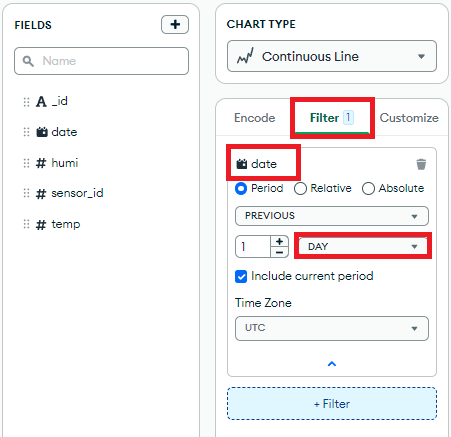

   8. After that, you may click on the "Save and close" button at the top right corner of the editor.

      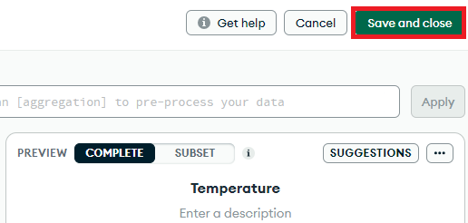
      <div style="page-break-after: always;"></div>
   9. Outside the editor, we can see a refresh button, click on it, select the refresh settings.
   
      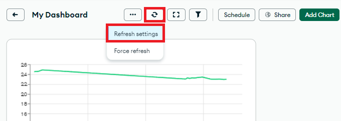
   9. We can change the refresh interval to 1 minute. Then, click on the Save button.

      
   
   9. **Exercise: Create a chart for humidity data**
      Please create a chart for humidity using the same steps as above.

## Submission

You have to submit the follwing items to the Moodle submission boxes.

- MongoDB connection string (the uri)
-  **`sensor.py`**
- MongoDB Atlas Dashboard Link (with two charts)

## Discussion
Question: What kinds of statistics or visualizations can we make after we 
- Answer the discussion questoin in the Moolde submission box.

## References

- Embed charts and dashboards — MongoDB charts. (n.d.). MongoDB: The Developer Data Platform | MongoDB. https://www.mongodb.com/docs/charts/embed-charts-and-dashboards/

- (n.d.). Learn Python Programming - Python Tutorial. https://pythonbasics.org/

- Learn Python programming. (n.d.). Programiz: Learn to Code for Free. https://www.programiz.com/python-programming

- Rock Pi 4 - the next generation RPI. (n.d.). Meet ROCK - Single Board Computers from Radxa. https://rockpi.org/rockpi4

- Tutorial. (n.d.). PyMongo 4.4.1 documentation. https://pymongo.readthedocs.io/en/stable/tutorial.html